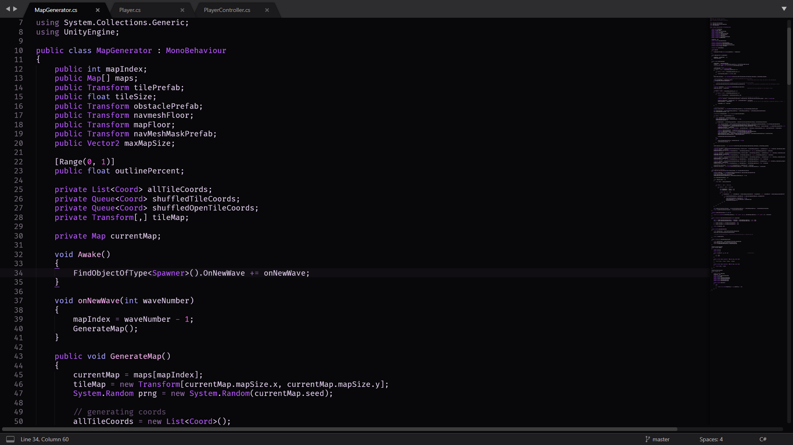

    

# Lilac for Sublime

A dark theme with pretty pastel colours for Sublime Text.

---

Lilac was designed to be aesthetically pleasing and caters to the pastel-goth chick within me.

The theme is also available for Visual Studio Code, Mozilla Firefox, Hyper terminal and Kermit terminal.

---

## Install

### Install using Package Control

If you are using [Package Control](http://wbond.net/sublime_packages/package_control), you can easily install Lilac via the `Package Control: Install Package` menu item. The Dracula Theme package is listed as `Lilac` in the packages list.

### Install using Git

Alternatively, if you are a git user, you can install the theme and keep up to date by cloning the repo directly into your `Packages` directory in the Sublime Text application settings area.

You can locate your Sublime Text `Packages` directory by using the menu item `Preferences -> Browse Packages...`.

While inside the `Packages` directory, clone the theme repository using the command below:

    $ git clone https://github.com/shubham-saudolla/Lilac-Sublime.git "Lilac Color Scheme"

### Install manually

1.  Download using the [GitHub .zip download](https://github.com/shubham-saudolla/Lilac-Sublime/archive/master.zip) option
2.  Unzip the files and rename the folder to `Lilac Color Scheme`
3.  Find your `Packages` directory using the menu item `Preferences -> Browse Packages...`
4.  Copy the folder into your Sublime Text `Packages` directory

### Activating theme

Go to `Preferences -> Color Scheme -> User` and select the `Lilac Color Scheme`.

---

## Support the project

To show support for the project, you can

- [Star the repository.](https://github.com/shubham-saudolla/Lilac-Sublime)
- [Follow me on Twitter, and say hi!](https://twitter.com/joyDivided13)
- [Follow me on Instagram.](https://www.instagram.com/s.phoenix99/)
- [Donate via PayPal.](https://paypal.me/shubhamsaudolla)

---

## Lilac for Visual Studio Code

Lilac was originally developed for the Visual Studio Code text editor, and is available [here](https://github.com/shubham-saudolla/Lilac-Theme).

---

## Lilac for Firefox

Lilac is available for the Firefox browser, [here](https://addons.mozilla.org/en-US/firefox/addon/lilactheme/).

---

## Lilac for Hyper Terminal

Lilac is also available for the Hyper terminal, [here](https://github.com/shubham-saudolla/hyper-lilac-theme).

---

## Lilac for Kermit Terminal

Lilac is also available for the [Kermit](https://github.com/orhun/kermit) terminal, [here](https://github.com/orhun/base16-kermit/blob/master/themes/base16-lilac.config).

---

## Useful Information

This port was possible beacuse of [tobiastimm's](https://github.com/tobiastimm) project, [code-theme-converter](https://github.com/tobiastimm/code-theme-converter).

Read more about it, [here](https://dev.to/tobiastimm/convert-any-visual-studio-code-theme-to-sublime-text-3-or-intellij-idea-jod).

The font in the screenshot is [Fira-Code](https://github.com/tonsky/FiraCode).

If you'd like to report a bug with the theme, please raise an issue with the repository.

👾 Shubham.
